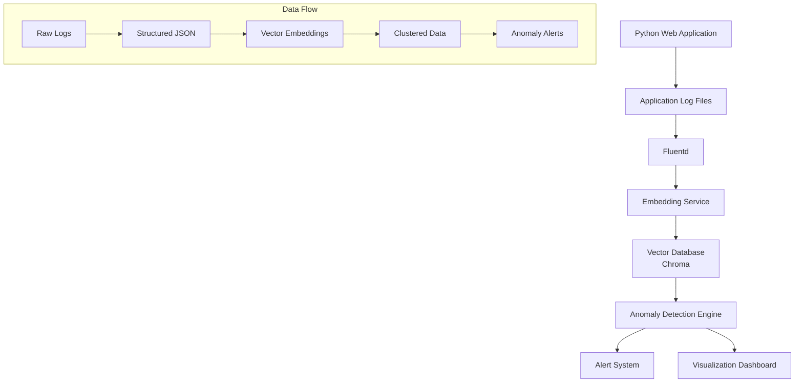

# Design Document

## Overview

セマンティックログ分析 PoC システムは、従来のキーワードベースのログ監視を超えて、ログメッセージの意味的内容を理解し、異常を検知するシステムです。本システムは以下の主要コンポーネントで構成されます：

1. **Python Webアプリケーション**: 実際のWebアプリケーションとして動作し、自然なログを出力するPythonアプリケーション
2. **ログ集約層**: Fluentdを使用したログ収集・構造化システム
3. **埋め込み処理サービス**: ログメッセージをベクトル化するサービス
4. **ベクトルデータベース**: 埋め込みベクトルの格納・検索システム
5. **異常検知エンジン**: クラスタリングと異常検知を行うシステム
6. **可視化・アラートシステム**: 結果の表示とアラート生成

## Architecture



## Components and Interfaces

### 1. Python Web Application

**責任**: 実際のWebアプリケーションとして動作し、リクエスト処理やビジネスロジック実行時に自然なログを出力

**技術仕様**:
- FastAPIまたはFlaskベースのWebアプリケーション
- RESTful APIエンドポイントを提供
- Python標準ライブラリのloggingモジュールを使用
- 構造化ログ出力（JSON形式）
- 複数のログレベル（INFO、WARN、ERROR）を自然に出力
- データベース操作、外部API呼び出し、ファイル処理等の機能を含む
- PoC検証用に既知/未知のログパターンを意図的に生成する機能

**主要エンドポイント**:
```python
# ユーザー管理API
GET /users - ユーザー一覧取得
POST /users - ユーザー作成
GET /users/{id} - ユーザー詳細取得
PUT /users/{id} - ユーザー更新
DELETE /users/{id} - ユーザー削除

# データ処理API
POST /data/process - データ処理実行
GET /data/status/{job_id} - 処理状況確認

# ヘルスチェック
GET /health - アプリケーション状態確認

# テスト用エンドポイント（PoC検証用）
POST /test/generate-known-error - 既知のエラーパターンを生成
POST /test/generate-unknown-error - 未知のエラーパターンを生成
POST /test/generate-normal-logs - 通常のログパターンを生成
```

### 2. Log Aggregation Layer (Fluentd)

**責任**: ログファイルの監視、収集、構造化

**技術仕様**:
- Fluentd v1.16+を使用
- tail inputプラグインでログファイル監視
- JSON parserでログ構造化
- HTTP outputで埋め込みサービスに転送

**設定例**:
```xml
<source>
  @type tail
  path /var/log/app/*.log
  pos_file /var/log/fluentd/app.log.pos
  tag app.logs
  format json
</source>

<match app.logs>
  @type http
  endpoint http://embedding-service:8080/process
  http_method post
</match>
```

### 3. Embedding Service

**責任**: ログメッセージのベクトル化処理

**技術仕様**:
- FastAPIベースのRESTサービス
- sentence-transformersライブラリを使用
- 英語技術文書に最適化されたモデル（all-MiniLM-L6-v2）
- バッチ処理対応

**インターフェース**:
```python
class EmbeddingService:
    def embed_log_message(self, message: str) -> List[float]
    def batch_embed(self, messages: List[str]) -> List[List[float]]
```

**API仕様**:
```
POST /process
Content-Type: application/json

{
  "timestamp": "2025-01-01T12:00:00Z",
  "level": "ERROR",
  "message": "Database connection failed",
  "service": "user-service"
}

Response:
{
  "timestamp": "2025-01-01T12:00:00Z",
  "level": "ERROR", 
  "message": "Database connection failed",
  "service": "user-service",
  "embedding": [0.1, -0.2, 0.3, ...]
}
```

### 4. Vector Database (Chroma)

**責任**: ベクトルデータの永続化と類似度検索

**技術仕様**:
- ChromaDB v0.4+を使用（PoC用途に最適）
- コサイン類似度による検索
- メタデータフィルタリング対応
- Python APIでの操作

**インターフェース**:
```python
class VectorStore:
    def add_log_vector(self, log_data: dict, embedding: List[float]) -> str
    def search_similar(self, query_vector: List[float], k: int = 10) -> List[dict]
    def get_all_vectors(self) -> List[dict]
```

### 5. Anomaly Detection Engine

**責任**: クラスタリングと異常検知の実行

**技術仕様**:
- scikit-learnのDBSCANアルゴリズムを使用
- 動的閾値設定（eps=0.3, min_samples=2）
- 新規ログの異常度スコア計算
- 定期的なクラスタ更新

**インターフェース**:
```python
class AnomalyDetector:
    def fit_clusters(self, embeddings: List[List[float]]) -> None
    def detect_anomaly(self, embedding: List[float]) -> Tuple[bool, float]
    def get_cluster_info(self) -> dict
```

### 6. Visualization Dashboard

**責任**: システム状態の可視化とアラート表示

**技術仕様**:
- Streamlitベースのダッシュボード
- リアルタイムログ表示
- クラスタ可視化（t-SNE/UMAP）
- 異常検知結果の表示

## Data Models

### LogEntry
```python
@dataclass
class LogEntry:
    timestamp: datetime
    level: str  # INFO, WARN, ERROR
    message: str
    service: str
    embedding: Optional[List[float]] = None
    cluster_id: Optional[int] = None
    anomaly_score: Optional[float] = None
```

### AnomalyAlert
```python
@dataclass
class AnomalyAlert:
    timestamp: datetime
    log_entry: LogEntry
    anomaly_score: float
    reason: str
    similar_logs: List[LogEntry]
```

## Error Handling

### 1. Embedding Service Failures
- **問題**: 埋め込みモデルの推論エラー
- **対策**: エラーログの記録、デフォルトベクトルの使用、リトライ機構

### 2. Vector Database Connection Issues
- **問題**: ChromaDBへの接続失敗
- **対策**: 接続プールの使用、自動再接続、ローカルキャッシュ

### 3. Clustering Failures
- **問題**: DBSCANクラスタリングの失敗
- **対策**: パラメータの動的調整、フォールバック手法の実装

### 4. Data Quality Issues
- **問題**: 不正なログ形式、欠損データ
- **対策**: 入力検証、データクリーニング、エラー報告

## Testing Strategy

### 1. Unit Testing
- 各コンポーネントの個別機能テスト
- モックを使用した依存関係の分離
- カバレッジ目標: 80%以上

### 2. Integration Testing
- コンポーネント間の連携テスト
- エンドツーエンドのデータフローテスト
- 異常シナリオのテスト

### 3. Performance Testing
- 埋め込み処理のレイテンシ測定
- ベクトル検索の性能評価
- メモリ使用量の監視

### 4. Anomaly Detection Accuracy Testing
- 既知の異常ログでの検知率測定
- 偽陽性率の評価
- 閾値パラメータの最適化
- テスト用エンドポイントを使用した検証:
  - 既知パターンログが正しくクラスタリングされることの確認
  - 未知パターンログが異常として検知されることの確認
  - 類似度スコアの妥当性検証

## Deployment Architecture

### Development Environment
```
docker-compose.yml:
- web-app: Python Web Application (FastAPI/Flask)
- fluentd: Log aggregation
- embedding-service: FastAPI service
- chroma: Vector database
- anomaly-detector: Detection engine
- dashboard: Streamlit UI
- postgres: Database for web application
```

### Configuration Management
- 環境変数による設定管理
- Docker Composeでのサービス連携
- ボリュームマウントによるデータ永続化

### Monitoring and Observability
- 各サービスのヘルスチェック
- メトリクス収集（処理時間、エラー率）
- ログレベルでのデバッグ情報出力